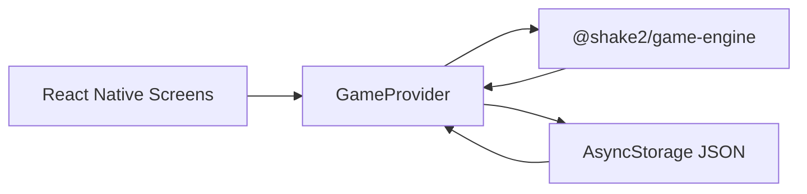
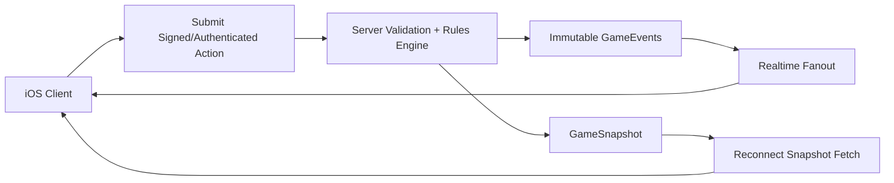

# Architecture Review

Last reviewed: 2026-05-29

## Executive Assessment

The current architecture is a good Milestone 1 scorekeeper prototype, but it is not yet shaped for real-time multiplayer Texas 42. The most important positive choice is keeping scorekeeper logic in `packages/game-engine` instead of embedding it in screens. The biggest risk is that the current state model is snapshot-oriented, client-authoritative, and local-only, while the target product needs deterministic rules, server-authoritative actions, event replay, reconnects, and conflict handling.

## What Is Working

- The monorepo layout matches the intended app/package separation for `apps/mobile`, `packages/game-engine`, and `packages/shared`.
- The engine is pure TypeScript and independent of React Native, Expo, AsyncStorage, and AWS.
- Scorekeeper engine code is split into command, selector, dealer, validation, persistence, and type modules.
- Navigation is simple and understandable for M1.
- Scorekeeper state is serializable JSON.
- Local persistence now has a versioned envelope and migrates the original raw-array format.
- Basic engine tests exist, and they cover the most important current business behavior.
- Local persistence is isolated in `apps/mobile/src/storage/gameStorage.ts`, not scattered through screens.

## Critical Gaps For Real-Time Multiplayer

1. No server-authoritative model exists.

The current `GameProvider` applies commands locally and saves the result. Multiplayer must invert that flow: client submits an action, server validates, server persists an event/snapshot, clients receive authoritative state.

2. No event log or action contract exists.

The docs say "Store immutable events when possible", but current persistence writes full mutable game snapshots. Realtime rooms need durable event IDs, actor IDs, idempotency keys, timestamps, sequence numbers, action types, and schema versions.

3. The game engine is not yet a rules engine.

Current commands track marks and dealer. There is no domino model, shuffle/deal, bidding, trump, legal-play validation, trick resolution, count domino scoring, or bid evaluation.

4. State shape is not future-proofed.

`ScorekeeperGame` is useful for M1, but not enough for a server snapshot. Future state needs room/session metadata, player identities, seats, connection state, current phase, hand state, trick state, bidding state, action history, and variant config.

5. Local persistence is still snapshot-only.

AsyncStorage now stores a versioned document, but it still persists mutable snapshots rather than immutable events. That is fine for local scorekeeping, but it is not the multiplayer persistence model.

6. `packages/shared` is not carrying contracts.

Shared API/event types should eventually live in a package consumed by mobile and backend. Today the meaningful contracts are in `game-engine`.

7. No backend workspace exists.

Original docs list `/backend` and Amplify Gen 2, but the repo has no backend app, auth model, schema, resolver code, or deployment config.

## Current Data Flow

This is correct for a local scorekeeper and wrong for multiplayer authority.

## Target Multiplayer Data Flow

The same pure engine should be usable on the server for validation and optionally on the client for previews, but server results must win.

## Recommended Architecture Direction

- Keep `packages/game-engine` pure, deterministic, and side-effect-free.
- Split scorekeeper-only logic from full-game rules logic before adding M2.
- Add a `packages/contracts` or expand `packages/shared` for versioned action/event/snapshot types.
- Introduce a command/event model:
  - `GameAction`: requested by clients.
  - `GameEvent`: accepted immutable server fact.
  - `GameSnapshot`: materialized state for reconnect/rendering.
  - `GameCommandResult`: validation result plus generated events.
- Inject clocks, IDs, random shuffle seeds, and player identity into engine commands instead of generating them inside engine logic.
- Add schema versions to every persisted client/server document.
- Keep mobile UI as a renderer and action submitter, not a rules authority.

## Architecture Decisions Needed Soon

- Whether the full rules engine lives in `packages/game-engine` beside scorekeeper logic or in submodules such as `scorekeeper/` and `rules/`.
- Whether to use Amplify/AppSync subscriptions directly or place a custom realtime/game service behind AppSync for stricter ordering.
- How to represent Texas 42 variants without fragmenting the rules engine.
- Whether to preserve local scorekeeper games as a separate mode from multiplayer games.
- How reconnect snapshots and event replay interact when a client misses events.

## High-Risk Areas

- Event ordering and idempotency: AppSync subscriptions alone do not solve all gameplay ordering concerns.
- Server validation latency: client UX may need optimistic previews, but server must remain authoritative.
- Randomness: dealing must be reproducible/auditable server-side, not client generated.
- Reconnect: snapshot version and last-seen event sequence must be part of the protocol.
- Rule variants: unmodeled variants can poison assumptions in legal-play validation.

## Concrete Recommendations

1. Add ADR-0002 for the M1 local-first scorekeeper deviation from the original AWS architecture.
2. Add ADR-0003 for event-sourced server-authoritative multiplayer state.
3. Add a user-facing local data reset/recovery path before App Store release.
4. Continue refining engine domain boundaries before implementing domino rules.
5. Define multiplayer action/event/snapshot types before building `/backend`.
6. Add CI with typecheck, engine tests, and audit reporting.
